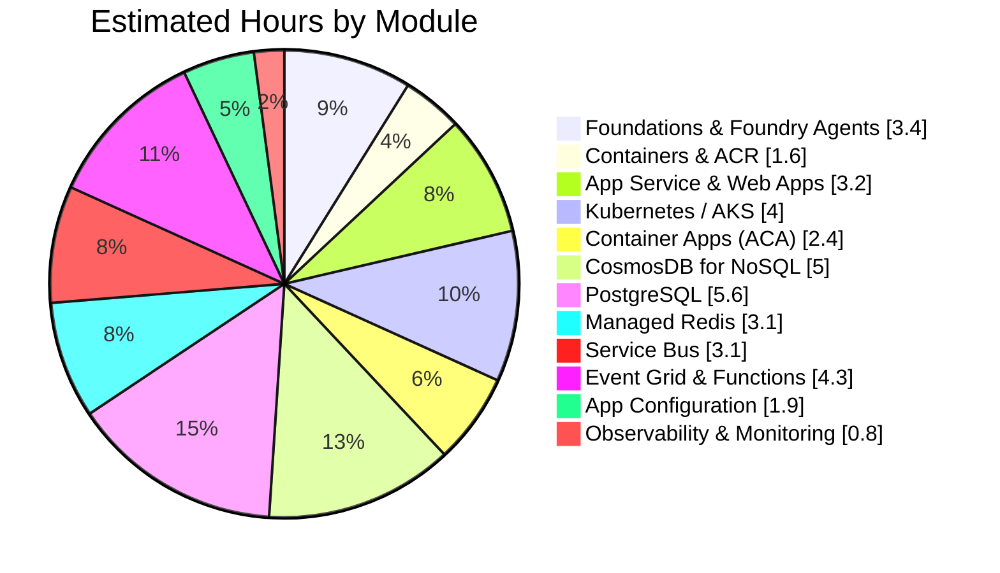

# AI-200: Azure AI Cloud Developer Associate

Tracking progress through the AI-200 certification course as part of leveling up my Azure skills — containers, Kubernetes, databases, messaging, and the surrounding cloud-native ecosystem.

## Progress at a glance

| Module | Est. Hours | Status |
|---|---|---|
| 13 modules | ~38.4h | Not started |

Update the numbers above manually as modules are completed — GitHub re-renders the chart from whatever values are in this file.

---

## Checklist

- [x] **Foundations & Course Setup** — 0.7h — GenAI jargon, Foundry ecosystem & tools
- [ ] **Foundry Agents, SDK & RAG intro** — 2.7h — Foundry resource + OpenAI labs, agents, RAG, vector embeddings
- [ ] **Containers & ACR** — 1.6h — Docker, building/running locally, pushing & managing images
- [ ] **Azure App Service & Web Apps** — 3.2h — Deploying containers, managed identity, Key Vault, deployment slots
- [ ] **Kubernetes / AKS** — 4.0h — Cluster creation, kubectl, ACR integration, networking, ConfigMaps, sidecars, PV/PVC
- [ ] **Azure Container Apps (ACA)** — 2.4h — Environments, revisions, secrets, KEDA event-driven scaling
- [ ] **Azure CosmosDB for NoSQL** — 5.0h — CRUD, indexes, RAG, vector storage, hybrid search, consistency model
- [ ] **Azure Database for PostgreSQL** — 5.6h — Schema, JOINs, CTEs, JSON, vector storage, RAG chatbot
- [ ] **Azure Managed Redis** — 3.1h — Data ops, pub/sub, streams, vector similarity search
- [ ] **Azure Service Bus** — 3.1h — Queue structure, receive modes, dead-lettering, topics & subscriptions
- [ ] **Event Grid & Azure Functions** — 4.3h — Event Grid topics, HTTP & queue-triggered Functions, secrets
- [ ] **Azure App Configuration** — 1.9h — Config resource, sentinel key refresh, Key Vault refs, feature flags
- [ ] **Observability & Monitoring** — 0.8h — Tracing an AI agent, dashboards, KQL queries

---

## Notes

- Real-world AKS work (ingress, RBAC, scaling policy, monitoring) usually needs more than a single course module — [Microsoft Learn's AKS docs](https://learn.microsoft.com/en-us/azure/aks/) are a good next step once past the basics here.

## How to use this

Check items off with `- [x]` as completed, commit as you go (e.g. `git commit -m "AI-200: finish AKS module"`), and update the hours table/chart when a module wraps up.